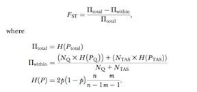
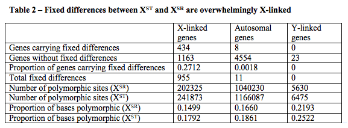
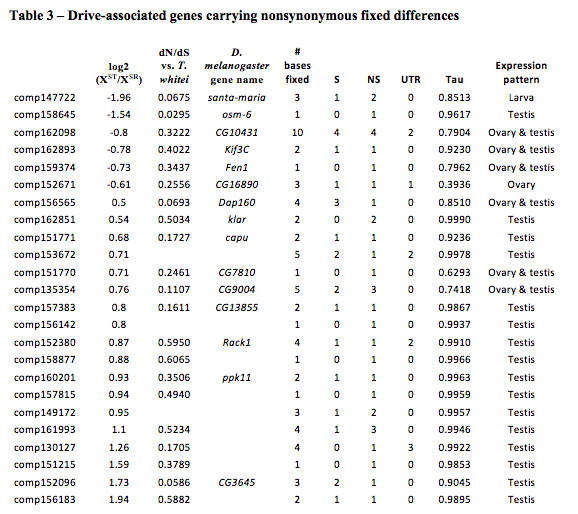
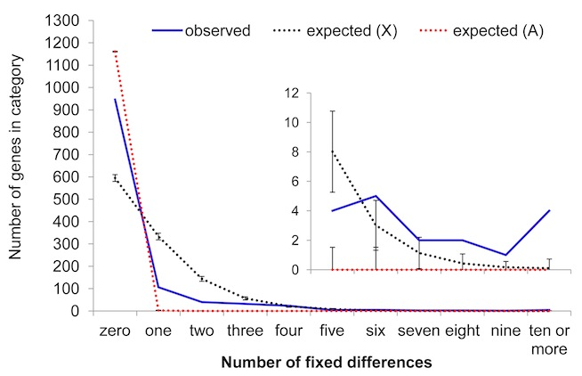

Calling variants in RNAseq data
=============================================
Josie Reinhardt, Wilkinson lab (BioPsych 2246, reinharj@umd.edu, x56949)
Sept 24, 2013

###What this is...

This is my solution to solve a particular problem I had.

This is not a comprehensive overview of SNP calling using RNAseq data (sorry!)

---------------
##Introduction
### Overview of the problem (biology)

Every field of genetics from evolutionary genetics to crop science to cancer biology is interested in how gene variants affect phenotype.  

In general, to answer this question, we must obtain genetic information from multiple individual(s) from at least two different groups.

Examples

0. **Case vs Control studies** - e.g. cancer patients vs matched controls
1. **Adaptation** - Populations of a single species adapted to different conditions
2. **Speciation** - Recently diverged species pairs
3. **Population genetics** - Gene flow/migration/relatedness metrics between/within populations

My question is a variant of #1.  We want to know which genes/regions of the genome are causal to meiotic drive in an outbred population of stalk eyed flies.  First step is to identify positions that are differentiated between flies with and without meiotic drive.

####Meiotic drive:

Also called segregation distortion, a particular allele is over-represented compared to other alleles among the gametes and hence in the individuals in the next generation.

Most commonly found in male meiosis - sperm which carry the non-driving chromosome are rendered nonfunctional by the driving chromosome.  Can also occur through preferential assortment of driving alleles into the oocytes as opposed to the polar bodies in female meiosis.

If a driving locus is on the X or Y chromosome, meiotic drive leads to a distortion of the sex ratio in the next generation.

####Our system:

In the stalk-eyed fly Teleopsis dalmanni, sex chromosome meiotic drive alleles are carried by 15-30% of the population.  

Previous research suggested that much of the driving X chromosome carries an inversion that prevents recombination with other X chromosomes.  Hence, this X chromosome is on an independent evolutionary trajectory from the other X chromosomes.  

We predicted that the driving X chromosome should therefore have many sites which are genetically differentiated from the standard X chromosomes.  We do not know the size of the region of recombination suppression. 

We were also interested in whether genes were expressed differentially in the meiotic drive males compared to control males.  

##Approach

####Samples:
RNA from two POOLS each of testes from outbred individuals carrying the meiotic drive X or a standard X chromosome (determined by genotyping).  Each pool represents data from approximately 30 individuals.  Sequence these 4 pools - 2 4x multiplexed lanes of Illumina GA (not Hi-seq)

#### FST and whole-genome sequencing:

FST is the "fixation index".  It is a measure of the extent of genetic differentiation between
two groups.  

	if FST = 0 - the two groups are genetically indistinguishable.  
	if FST = 1 - the two groups are genetically separate.  
	
Traditionally, a single FST value would be calculated across all genetic data and it would usually be used to determine whether gene flow was occurring between populations.

It is also possible to calculate FST separately for each locus (or even per site).  This can allow determination of which locus or loci are most differentiated between populations, and hence is sometimes used to detect selection acting on a gene.

A few methods for calculating FST using whole genome sequencing from pools of individuals 
have been published, e.g. [Kolacczkowski et al 2011](http://www.ncbi.nlm.nih.gov/pmc/articles/PMC3018305/), 

From the paper...

 

where 

	n = the number of individuals in a pool (60 for us) 
	m = the sequence coverage (varies by position), 
	H = heterozygosity 

...but no one has tried this with RNAseq data...  Why?

1. If two individuals within a pool vary in expression level at a given position, we will
see a distortion in the within-population allele frequency.

2. Likewise if the two pools vary in expression level, we will see a distortion in the 
across population estimate of allele frequency. 

3. Extremely high coverage at some positions can lead to calling positions polymorphic when in fact we have simply multiple sequencing errors (e.g. if per bp error rate is 1%, then we expect sites that have 400x or more coverage to often make the same error twice).  It would be difficult to set a coverage range that represents most of the data and yet avoids this problem.  Downsampling is a potential solution but also loses a lot of data.

**Conclusion** - until I have a good comparison dataset (e.g. WGS from the same pools) to validate this technique (anyone have one??) I'd better take estimates of FST based on allele frequency with a grain of salt.

**However** - If a site is fixed between two populations (FST=1), these problems don't apply.  This is because the allele frequency at fixed sites = 0 for both populations.  Further, a fixed difference call is actually conservative to the high coverage positions (e.g., a fixed difference will NOT be called in case 3 above).  

After some deliberation, although there are a lot of sites with intermediate allele frequencies, I decided to report only fixed differences (FST=1) in the final paper.  

#### Specific steps in analysis:

1. **Generate reference transcriptome** - Assemble transcriptome from raw reads  sequenced from a variety of tissues using Trinity 
3. **Align** - Align reads using bwa to obtain SAM alignments against the transcripts
4. **DE analysis** - I used RSEM and DESeq to obtain measures of differential expression (with replication) for each transcript.  I also use these measures to filter out weakly expressed transcripts (mostly things that are specifically expressed in other tissues).
5. **Samtools** - Use "samtools sort" and "samtools pileup" to obtain sequence data at each basepair for all transcripts in drive and nondrive samples. **See examples** [drive](FST_example/drive.shared.ex.pu) and [nondrive](FST_example/nondrive.shared.ex.pu)  At this point, I pooled the data across replicates.
4. **Transcript name filter** - Filter any transcripts that are not present in both files.  this reduces file size and reduces complexity of final step
5. **Calculate FST** - Run 
[my script](FST_example/FST_from_transcript_pileups_count_fixsites_rmtri.pl) on these two files.  Briefly, For each transcript, go site by site.  Estimate heterozygosity within and between populations, and then calculate FST between the two samples at each position after applying some additional filters (toss any trialleles or singletons). Identify the most highly differentiated sites (FST=1).

Example output:

[raw output](FST_example/out.raw.txt)

[summary output](FST_example/out.summary.txt)

##Results and validation

Remember that we expected only genes on the X Chromosome should have fixed differences (assuming that there are not unknown inversions on other chromosomes that are also drive associated...

 

Genes with fixed differences of interest...

 

Figure 2 - a simulation demonstrating fewer genes carry fixed differences than would be expected if the entire X chromosome was nonrecombining.  Conclusion - only part of the X chromosome is nonrecombining.

 

For details of the simulation please see

[R code and sample data](R_example/)

### Conclusions

There are many fixed differences between genes on the X chromosome and Autosomes!  However, not so many that we think the whole X chromosome is nonrecombining.  Some of them might contribute to meiotic drive or associated phenotypic changes (e.g. we identified some candidates).

In general - it is fairly straightforward to call fixed differences using RNAseq data (even if the way I explained it wasn't).  It is possible to calculate FST using this method, but at this point it's theoretical how biologically correct such estimates would be...  Does anyone happen to have a matched set of pooled RNAseq and WGS sitting around so we could validate the method?
